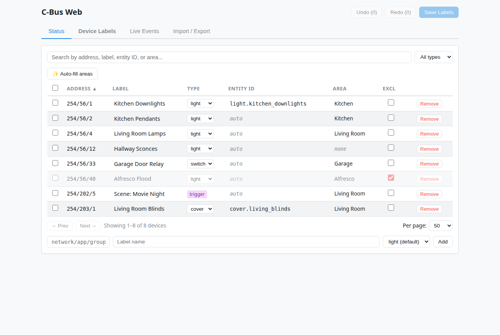
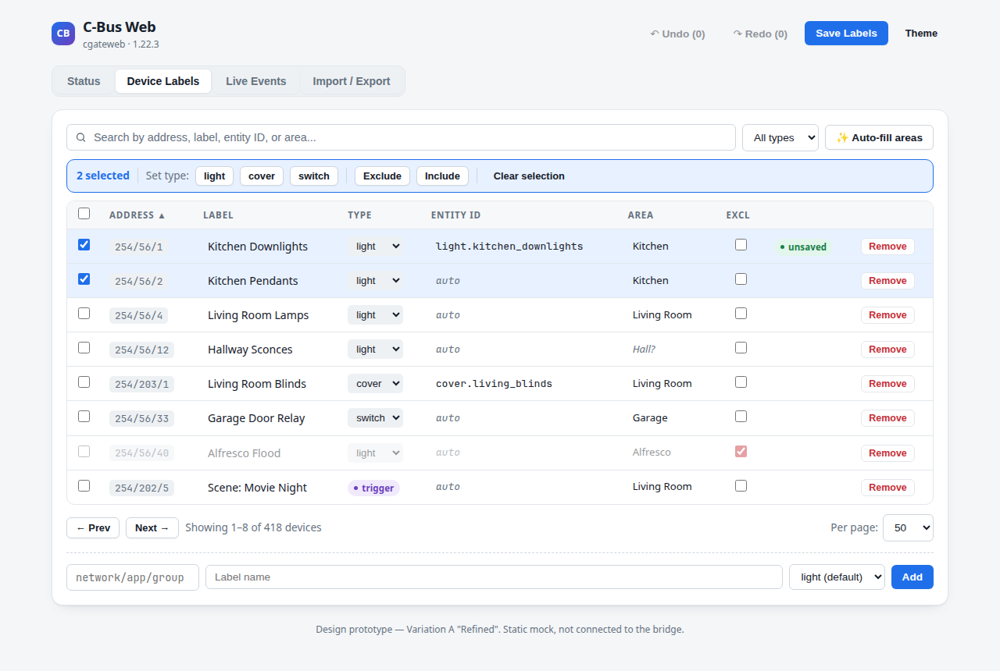
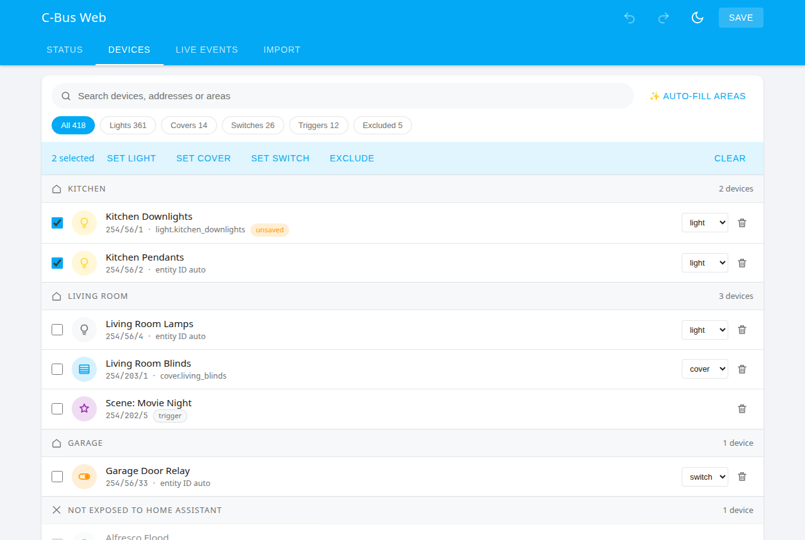
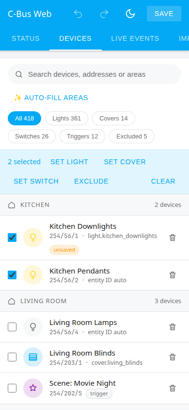
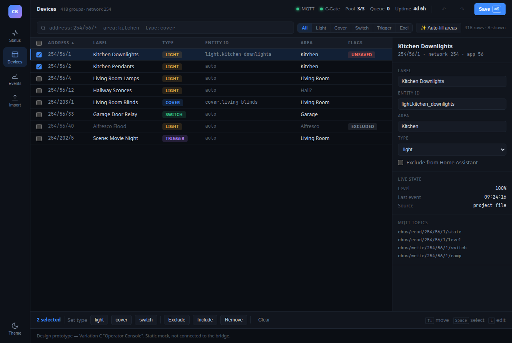

# Web UI visual refresh - three concepts

Three self-contained prototypes of what a visual refresh to the cgateweb web UI
(`public/index.html`) could look like. Each is a static HTML file with fake data:
nothing is wired to the API, so they are safe to open anywhere.

```
docs/design/web-ui-refresh/
  variation-a-refined.html     Same layout, new design tokens
  variation-b-ha-native.html   Looks like part of Home Assistant
  variation-c-console.html     Dense operator console
```

Open a file directly in a browser. Both variations accept two query parameters:
`?theme=dark` or `?theme=light` to force a palette, and `?tab=status|labels|events|import`
to land on a specific view. There is also a Theme button in each prototype.

## What the refresh is trying to fix



The current UI works, and none of this is about features. The observations that
drove all three concepts:

- **Connection state reads as plain text.** On the Status tab, "connected",
  "1.22.3" and "0" are all rendered at the same size and weight, so the eye has
  nothing to lock onto. Whether the bridge is healthy should be answerable in a
  glance, and today it takes a read.
- **Health is only visible on one tab.** You have to leave the device table to
  find out that MQTT dropped.
- **The palette is generic.** The blue is Mantine's default rather than Home
  Assistant's, so inside an ingress iframe the panel looks like a different
  product bolted into HA.
- **The device table is styled loosely for its job.** Zebra striping plus row
  hairlines plus a header underline is three separators doing one job, while the
  addresses - the thing people actually scan - get no visual distinction from
  labels.
- **Density is neither compact nor comfortable.** Rows are 6px-padded but the
  type is 0.9rem, which gives a cramped-yet-tall row. A 418-group install shows
  very few rows per screen.
- **Mobile degrades by hiding columns.** It works, but the Entity ID and Type
  columns silently disappear, and the remaining table still needs sideways
  scrolling on a phone.

## Variation A - "Refined"



Same layout, same DOM, new design tokens. Tabs become a segmented control,
cards get a larger radius and a real elevation token, the status tiles gain
coloured state dots so connection state is pre-attentive, addresses become
monospace chips, zebra striping is dropped in favour of hairlines plus a hover
tint, and badges become pills. Buttons get a visible hierarchy (filled primary,
outlined secondary, ghost tertiary) instead of three near-identical greys.

**Cost:** the `<style>` block only. No markup, no JS, no API changes. The
mobile `nth-child` column-hiding rules keep working because the column order
does not move.

**Trade-off:** it is the same product with better clothes. It does not fix
health-only-on-one-tab, the phone experience is still a table, and rows grow
from 31px to 35px, so it buys legibility with a little density.

## Variation B - "Home Assistant Native"



Borrows Home Assistant's own design language: a primary-coloured app bar with
tabs, `ha-card` surfaces (12px radius, Material elevation, no border), the HA
blue and dark palette, and entity rows with a circular icon, primary and
secondary text. Devices are grouped by area, matching how people think about
their house and how HA itself organises things, with excluded devices collected
under "Not exposed to Home Assistant". Filter chips replace the type dropdown,
and Live Events becomes a logbook-style feed.

The status tab becomes a system-health card of entity rows, each with a state on
the right, which is how HA presents the same kind of information.



**Cost:** a re-layout. `renderTable()` becomes a grouped-list renderer, the
header and tab markup change, and inline editing needs new affordances since
there are no longer table cells to click. The label/type/area/exclude state
model and every API call stay exactly as they are.

**Trade-off:** the best phone experience of the three and the most "belongs in
HA" feel, but the lowest density. Scanning 418 groups in a grouped list means a
lot of scrolling, and per-row Entity ID editing has to move into a detail view
or an expandable row.

## Variation C - "Operator Console"



Density first, dark first, built for the 400-group installs. An icon rail
replaces the tab bar, and a health strip lives in the top bar on every view, so
MQTT, C-Gate, pool and queue state are always on screen. The table becomes a
proper data grid: sticky header, monospace addresses, type as a coloured tag,
and 24px rows against today's 31px, so about a third more devices per screen
before the shorter page chrome is counted.

Selecting a row opens an inspector on the right with the full record - label,
entity ID, area, type, exclusion - plus live level, last-seen time, and the four
MQTT topics for that group, which currently exist only in the docs. The search
box takes a filter syntax (`area:kitchen type:cover`), the action bar advertises
keyboard shortcuts, and Live Events becomes a monospace stream.

On a phone the rail becomes a bottom tab bar and the inspector drops out.

**Cost:** the largest. New shell layout, an inspector component, keyboard
navigation, a filter parser, and the status view rebuilt around metrics. Some of
it wants data the API does not expose yet (events-per-minute, queue peak).

**Trade-off:** far and away the best tool for a big install and for debugging,
but it looks like a network appliance rather than a Home Assistant panel, which
is exactly the opposite of what B optimises for.

## Comparison

| | A - Refined | B - HA Native | C - Console |
|---|---|---|---|
| Files touched | `<style>` block only | style + markup + render JS | full rewrite of the shell |
| Device row height (today: 31px) | 35px | 50px | 24px |
| Feels like part of HA | Somewhat | Strongly | No |
| Phone | Table, columns hidden | Best | Bottom bar, grid scrolls |
| Health always visible | No | No | Yes |
| Risk to existing behaviour | Very low | Medium | High |

No test asserts on the UI markup (`tests/webServer.test.js` only checks that
`index.html` is served), so none of the three is blocked by the test suite.

## Constraints any of these has to respect

- **Single file, no build step.** `public/index.html` is served as-is by
  `StaticFileServer`. All three prototypes keep that: inline CSS, inline JS,
  inline SVG icons.
- **No CDN.** An add-on install may have no internet access, so no Google Fonts
  and no icon webfonts. Every icon here is hand-rolled inline SVG and every font
  stack is system fonts.
- **The panel runs in an HA ingress iframe.** No browser chrome, and the HA
  sidebar sits outside it, so a full-height left rail (variation C) has to work
  in an iframe that is already inside HA's own navigation.
- **Dark mode comes from `prefers-color-scheme`.** The iframe cannot read the
  HA theme, so the palette has to work without knowing it.
- **iOS zoom and touch targets.** The shipped CSS forces `font-size: 16px` on
  form fields to stop iOS auto-zoom and enlarges checkboxes on coarse pointers.
  Any refresh keeps both.

## A suggested path

Variation A is a contained change that lands the readability wins on its own.
Two ideas from the others are worth lifting into it later without adopting
either wholesale: the persistent health strip from C, which fixes the
health-only-on-one-tab problem for the cost of a header row, and area grouping
from B, as a toggle on the existing table rather than a replacement for it. The
inspector panel from C is the largest single addition and the one most worth
doing on its own, since it is where MQTT topics and live state would finally
become visible.
